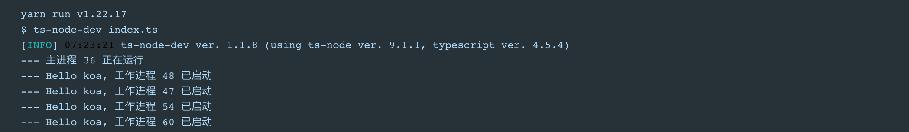

<h1 style="text-align: center">node-koa-deme</h1>

这是个人验证用的一个 node 服务仓库，使用了 koa 框架和 mongodb 的公有云数据库，并提供了 dockerfile 用于容器化。

## 环境&依赖

- node
- docker
- yarn

## 开始

**安装依赖**

```bash
yarn install
```

**启动**

```bash
yarn run start
```

启动成功则会输出如下日志


使用 `yarn run debug` 以获得更多的日志输出，并且可以直接在浏览器上进行调试。详情请参考 [Node 开发调试](https://chenshenhai.github.io/koa2-note/note/debug/info.html)

**构建镜像**

> 请先确保机器上已安装好 docker

```bash
docker build -f Dockerfile --no-cache -t node-koa-server:v1.0 .
```

<br>

## License

[MIT](https://choosealicense.com/licenses/mit/)
